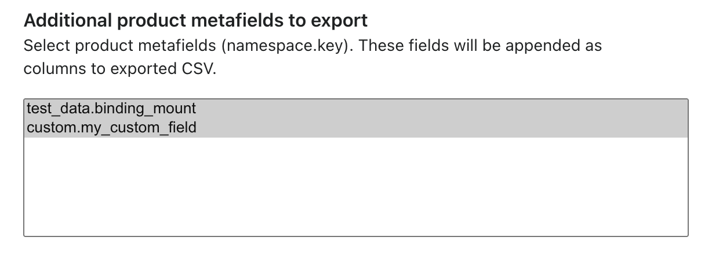
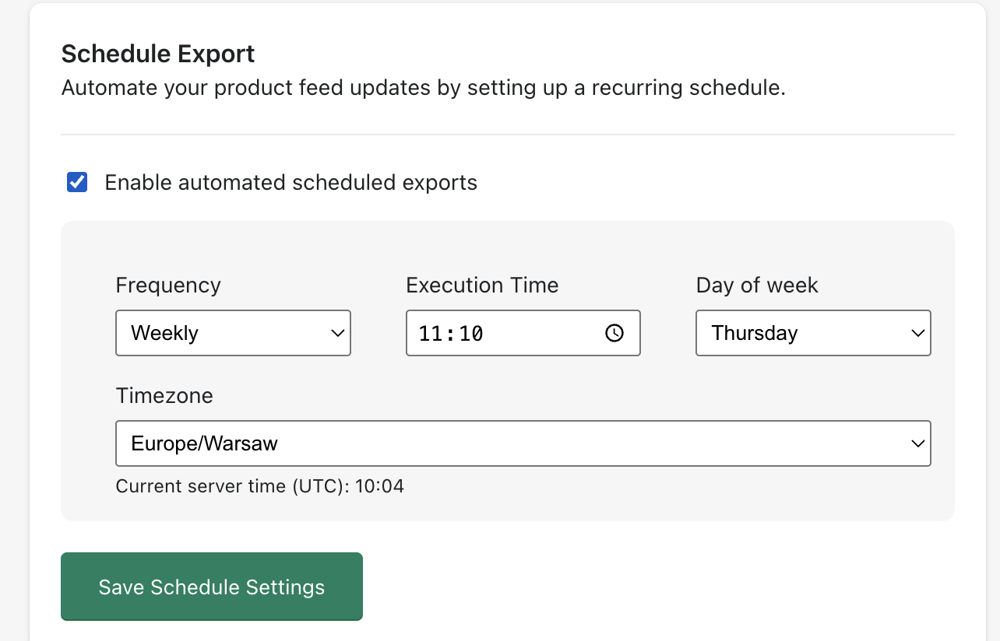

# FactFinder Export App

The **FactFinder Export App** is a Shopify integration (in the future we are going to add more platforms) that allows you to export your product data directly to **FactFinder** in a format compatible with FactFinder search and recommendation engine.

It provides an easy-to-use configuration screen inside your Shopify admin panel where you can manage connection settings, export options, and trigger product feed generation.

---

## 📑 Table of Contents

- [📦 What does the app do?](#-what-does-the-app-do)
- [⚙️ Installation](#-installation)
- [🔧 Configuration](#-configuration)
- [🔄 Real-Time Product Synchronization](#-real-time-product-synchronization)
- [⏰ Scheduled Export](#-scheduled-export)
- [🛠️ App Uninstall Behavior](#-app-uninstall-behavior)
- [🔒 Notes](#-notes)

---

## 📦 What does the app do?

- Exports products from your Shopify store (including variants, categories, images, and translations) into a CSV format required by **FactFinder**.
- Uploads the generated product feed automatically via **SFTP** to your FactFinder server.
- Supports multilingual product data (e.g., German, English, etc.).
- Allows testing of both the FTP connection and FactFinder import connection directly from the admin UI.
- Enables you to trigger a **manual product feed export** whenever needed.

---

## ⚙️ Installation

1. Install the app in your Shopify store from your private apps section (shopify app store installation will be added soon).
2. Once installed, navigate to the app configuration screen in your Shopify admin panel.
3. Fill in the configuration details (see below).

---

## 🔧 Configuration

The configuration page is divided into **3 main sections**:

### 1. Main Settings

- **Channel Mappings** - Channel mapping is where you can map your FF channel to Shopify Saleschannel and Language. This mapping is used for manual export, scheduled export, and real-time synchronization. (required)
- **Notification Email** - An email address where you want to receive success or error notifications regarding product exports (optional)

---

### 2. Upload Settings
Configure the connection to your FactFinder SFTP server.

- **Protocol** - Choose the protocol for file upload (currently only **SFTP** is supported) (required)

- **Server URL** - The SFTP server domain provided by FactFinder (e.g., `mydomain.fact-finder.de`) (required)

- **Port** - The port number used for the SFTP connection (required) .

- **Username** - Your FactFinder SFTP username (required)

- **Root Directory** - The directory path on the SFTP server where the feed should be uploaded (e.g., `/export`) (required)

---

### 3. Import Settings
Optional configuration if you want the app to automatically trigger a **FactFinder import** after each new CSV export.

- **FactFinder Server URL** - The URL of your FactFinder import endpoint (e.g., `https://mydomain.fact-finder.de/fact-finder`) (optional)

- **FactFinder Username** - The username used for authentication with the FactFinder import API (optional)

- **Password** - The corresponding password for the above account (optional)

---

### 4. Products Export
This section lets you control how and what products will be exported.

- **Select Channel Mapping** - Select the mapping you want to export. The list of mappings is the same as the one you defined in the main settings.
- **Export Data Feed button**  
  Clicking this button will:
    1. Generate a fresh product feed based on your settings.
    2. Upload the CSV file to your FactFinder SFTP server.
    3. Optionally trigger an automatic import if Import Settings are filled in.
    4. Send a notification email if configured.

---

## 🔍 Buttons & Actions

- **Save Configuration** - Saves all entered settings for future exports.

- **Test FTP connection**  
  Verifies that your **FTP/SFTP configuration** (server, port, username, password, directory) is correct.
    - ✅ If successful: You will see a confirmation message.
    - ❌ If incorrect: An error message will be displayed (e.g., wrong credentials, unreachable server).

- **Test Import connection**  
  Verifies that your **FactFinder import endpoint** is reachable and the provided credentials are correct.
    - ✅ If successful: Confirms that FactFinder import API can be triggered.
    - ❌ If incorrect: You will receive an error message.
---

## ✅ Example Workflow

1. Configure **Main Settings** and **Upload Settings** with your FactFinder account details.
2. (Optional) Configure **Import Settings** if you want to trigger automatic imports.
3. Click **Save Configuration**.
4. Use **Test FTP connection** and **Test Import connection** to ensure your settings are correct.
5. Choose a **Channel mapping**.
6. Click **Export Data Feed** to generate and upload your feed.

---

## 🧩 Additional product metafields to export

The app allows you to include **custom Shopify metafields** in the product export sent to **FactFinder**.

This feature enables you to enrich your FactFinder product data with additional attributes that are not part of Shopify’s default product schema, such as:

- Custom product attributes
- Marketing flags
- Technical parameters

---

### ⚙️ How It Works

- You can select one or more **Shopify product metafields** in the app configuration.
- Selected metafields are:
  - Fetched from Shopify during export
  - Added as **separate columns** in the generated CSV
  - Uploaded to FactFinder together with standard product fields
- Each metafield becomes a **dedicated attribute** in FactFinder and can be used for:
  - Search
  - Filtering
  - Sorting

---

### 📌 Metafield Mapping Rules

- Each metafield is exported using a **stable column name**
- The column name must match the attribute configuration in FactFinder
- Metafields are exported per product
- If a metafield value is missing for a product, the field is exported as empty

---

### ⚠️ Important Limitation (Known Issue)

> **Currently, the application only supports simple metafield types such as Single line text, Email, Multi-line text, Integer.**
---

> **Removing a metafield from the export after it has already been imported into FactFinder will cause the FactFinder import to fail.**

This happens because FactFinder expects a **stable data schema**.  
If a column that already exists in the FactFinder database structure is suddenly missing, the import process will reject the feed.

---

### 🛠️ Troubleshooting: FactFinder Import Fails After Removing a Metafield

**Problem**  
After removing a metafield from the export configuration, the FactFinder import fails.

**Root Cause**  
The removed metafield still exists as a column in the FactFinder database schema, causing a mismatch between the incoming CSV structure and the expected database structure.

**Solution (Required Action)**  
If a metafield is removed from the export, you must:

1. Open the **FactFinder Administration Panel**
2. Navigate to the channel management configuration
3. **Rebuild the database structure** with "Start installation assistant"
4. Ensure that the removed metafield column is no longer expected by FactFinder
5. Re-run the import or trigger a new export from the app

> ⚠️ This step is mandatory. The app cannot automatically update or remove existing database fields in FactFinder.

---

### ✅ Best Practices

- Treat exported metafields as **schema-level changes**
- Avoid removing metafields once they are in active use
- If a metafield is no longer needed:
  - Remove it from the export
  - Rebuild the FactFinder database structure immediately
- For testing purposes, use a **separate FactFinder channel**

---

### 💡 Recommendation

Before adding or removing metafields in a production environment:

- Review the current FactFinder attribute configuration
- Coordinate schema changes with your FactFinder setup
- Test changes on a staging or test channel when possible

## 🔄 Real-Time Product Synchronization

The **Real-Time Sync** feature allows your Shopify products to be synchronized with **FactFinder immediately** after they are created, updated, or deleted in Shopify — without waiting for a full CSV export.

This ensures that your FactFinder search index always reflects the **latest product changes** in your store.

---

### ⚡ How Real-Time Sync Works

When **Real-Time Sync** is enabled:

- Shopify **webhooks** listen for product events:
  - `product/create`
  - `product/update`
  - `product/delete`
- Each event is queued and processed asynchronously.
- Product data is fetched from Shopify via API.
- Products and variants are **inserted, updated, or removed** in FactFinder using the **FactFinder Records API**.

---

### 🧩 Supported Actions

| Shopify Event | FactFinder Action |
|---------------|-------------------|
| Product created | Insert product & variants |
| Product updated | Upsert (update or add missing variants) |
| Product deleted | Delete product & variants |

---

### ⚙️ Real-Time Sync Configuration

Real-Time Sync can be configured per ** Channel mapping** in main settings.

> 🔔 If Real-Time Sync is disabled, Shopify webhooks are **ignored** and no data is synchronized in real time.

---

### 🛡️ Smart Safety Mechanisms

To protect your FactFinder system and avoid unwanted sync operations, the app includes several safeguards.

#### ✅ Product Status Validation

Only products that are:

- `status = active`
- published to the selected **Sales Channel**

are synchronized.

Draft or unpublished products are automatically ignored.

---

#### 🚦 Bulk Operation Detection

Mass operations in Shopify (e.g. product imports, bulk edits) can trigger hundreds of webhooks.

To prevent overload:

- The app detects **bulk webhook activity**
- Real-Time Sync is **temporarily paused**
- Webhooks are acknowledged but **not processed**

This ensures system stability and prevents unnecessary API calls.

---

#### 🔁 Intelligent Error Handling & Retry System

- Temporary errors (e.g. API timeouts, network issues, HTTP 5xx) are **automatically retried**
- Permanent errors (e.g. invalid credentials, misconfiguration) are:
  - Logged
  - Stored in a dedicated error table
  - Reported via **email notification** (if configured)

After the maximum retry limit is exceeded, failed products are moved to a **sync error queue** for later inspection.

---

### 📬 Error Notifications

If a real-time synchronization permanently fails:

- An email notification is sent to the configured **Notification Email**
- The message contains:
  - Error description
  - Reason for failure
  - A suggestion to verify configuration settings

---

### 🔄 Real-Time Sync vs Manual Export

| Feature | Manual Export | Real-Time Sync |
|------|--------------|----------------|
| Trigger | Manual button click | Automatic (webhooks) |
| Data Format | CSV via SFTP | API (JSON) |
| Best for | Full catalog rebuilds | Instant updates |
| Error handling | Export summary email | Per-event retries & alerts |

> 💡 Both methods can be used **together** for maximum reliability.

---

### 📝 Notes & Best Practices

- Real-Time Sync is recommended for **small to medium product changes**
- For large catalog updates, use the **manual export**
- Ensure your Shopify products are:
  - Published
  - Assigned to the correct Sales Channel
- Verify your FactFinder API credentials (Import Settings) before enabling Real-Time Sync

---

## ⏰ Scheduled Export

The **Scheduled Export** feature allows you to automate the generation and upload of your product feed. This ensures your FactFinder index stays fresh without manual intervention.

### ⚙️ How to Configure Scheduling

In the **Schedule Export** section, you can define the following:

- **Enable automated scheduled exports** - Toggle this on to activate the automation.
- **Frequency** - Choose how often the export should run:
  - **Daily**: Runs every day at the specified time.
  - **Weekly**: Runs once a week on a specific day.
- **Execution Time** - The exact time (HH:MM) when the export process should start.
- **Day of Week** - (Only for Weekly) Select which day the export should trigger.
- **Timezone** - Select your local timezone to ensure the export runs at the correct hour for your business.

### ⚠️ Important: Planning Window & Timing

The system uses a **4-hour look-ahead window** to plan exports. This affects when your first automated export will actually start:

* **Logic**: The planner runs every 4 hours and schedules tasks that fall within the *next* 4-hour block.
* **The "4-hour" Rule**:
  * If you set the execution time to **4 hours or more** from now, the planner will pick it up in time to run **today**.
  * If you set the execution time to only **2 hours** from now, the current planning cycle has already passed that time, so the export will be scheduled for **tomorrow**.

> **Example**: If it is 12:00 PM now:
> - A schedule for 06:00 PM (6h away) will run **today**.
> - A schedule for 02:00 PM (2h away) will be planned for **tomorrow**.

### 🛡️ Reliability & Handling

- **Queue System**: Tasks are planned in advance and dispatched via a message bus with a `DelayStamp`.
- **Automatic Retries**: If the SFTP server is temporarily unavailable, the background worker will retry the export.
- **Collision Prevention**: The system uses a `LastPlannedAt` check to ensure an export isn't planned multiple times for the same window.

---

## 🧹 App Uninstall Behavior

When the app is uninstalled from Shopify:

- All configuration data is removed
- Real-Time Sync webhooks stop automatically
- No further product data is synchronized

---

## 🔒 Notes

- Make sure your Shopify products are published to the correct sales channel and have translations configured.
- Ensure your SFTP credentials provided by FactFinder are correct.
- If translations are not available for the selected language, the app will export default (main language) values.
- If you uninstall the app in Shopify, we will automatically delete all the data you entered for configuration from our database.
