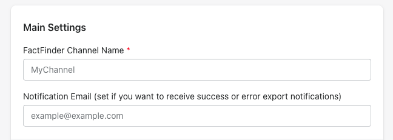
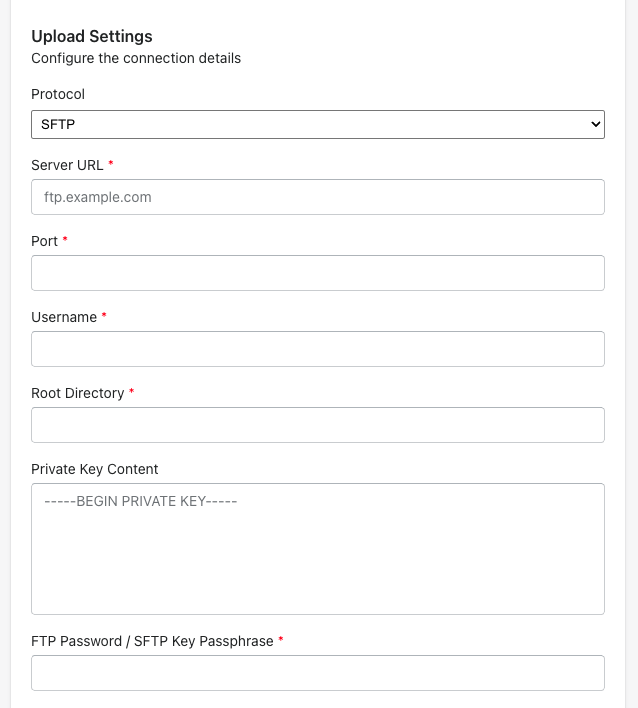
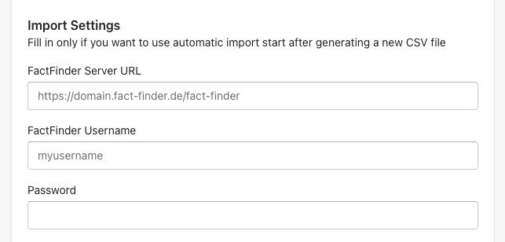
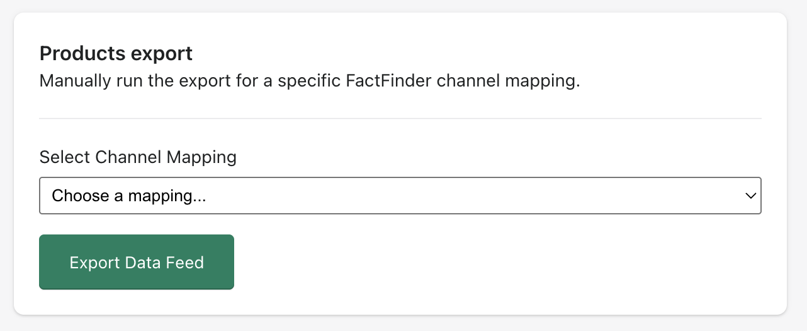
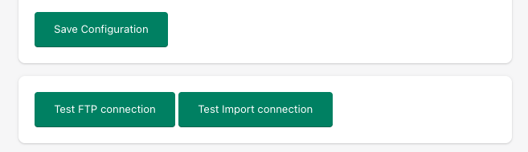

# FactFinder Export App

The **FactFinder Export App** is a Shopify integration (in the future we are going to add more platforms) that allows you to export your product data directly to **FactFinder** in a format compatible with FactFinder search and recommendation engine.

It provides an easy-to-use configuration screen inside your Shopify admin panel where you can manage connection settings, export options, and trigger product feed generation.

---

## 📦 What does the app do?

- Exports products from your Shopify store (including variants, categories, images, and translations) into a CSV format required by **FactFinder**.
- Uploads the generated product feed automatically via **SFTP** to your FactFinder server.
- Supports multilingual product data (e.g., German, English, etc.).
- Allows testing of both the FTP connection and FactFinder import connection directly from the admin UI.
- Enables you to trigger a **manual product feed export** whenever needed.

---

## ⚙️ Installation

1. Install the app in your Shopify store from your private apps section (shopify app store installation will be added soon).
2. Once installed, navigate to the app configuration screen in your Shopify admin panel.
3. Fill in the configuration details (see below).

---

## 🔧 Configuration

The configuration page is divided into **3 main sections**:

### 1. Main Settings

- **FactFinder Channel Name** - The name of the FactFinder channel where the exported feed will be uploaded (e.g., `store_channel_en`) (required)
- **Notification Email** - An email address where you want to receive success or error notifications regarding product exports (optional)

---

### 2. Upload Settings
Configure the connection to your FactFinder SFTP server.

- **Protocol** - Choose the protocol for file upload (currently only **SFTP** is supported) (required)

- **Server URL** - The SFTP server domain provided by FactFinder (e.g., `mydomain.fact-finder.de`) (required)

- **Port** - The port number used for the SFTP connection (required) .

- **Username** - Your FactFinder SFTP username (required)

- **Root Directory** - The directory path on the SFTP server where the feed should be uploaded (e.g., `/export`) (required)

---

### 3. Import Settings
Optional configuration if you want the app to automatically trigger a **FactFinder import** after each new CSV export.

- **FactFinder Server URL** - The URL of your FactFinder import endpoint (e.g., `https://mydomain.fact-finder.de/fact-finder`) (optional)

- **FactFinder Username** - The username used for authentication with the FactFinder import API (optional)

- **Password** - The corresponding password for the above account (optional)

---

### 4. Products Export
This section lets you control how and what products will be exported.

- **Sales Channel** - Select which Shopify sales channel you want to export products from (e.g., Online Store).

- **Language** - Select the language of product data to export (translations are supported).

- **Export Data Feed button**  
  Clicking this button will:
    1. Generate a fresh product feed based on your settings.
    2. Upload the CSV file to your FactFinder SFTP server.
    3. Optionally trigger an automatic import if Import Settings are filled in.
    4. Send a notification email if configured.

---

## 🔍 Buttons & Actions

- **Save Configuration** - Saves all entered settings for future exports.

- **Test FTP connection**  
  Verifies that your **FTP/SFTP configuration** (server, port, username, password, directory) is correct.
    - ✅ If successful: You will see a confirmation message.
    - ❌ If incorrect: An error message will be displayed (e.g., wrong credentials, unreachable server).

- **Test Import connection**  
  Verifies that your **FactFinder import endpoint** is reachable and the provided credentials are correct.
    - ✅ If successful: Confirms that FactFinder import API can be triggered.
    - ❌ If incorrect: You will receive an error message.
---

## ✅ Example Workflow

1. Configure **Main Settings** and **Upload Settings** with your FactFinder account details.
2. (Optional) Configure **Import Settings** if you want to trigger automatic imports.
3. Click **Save Configuration**.
4. Use **Test FTP connection** and **Test Import connection** to ensure your settings are correct.
5. Choose a **Sales Channel** and **Language**.
6. Click **Export Data Feed** to generate and upload your feed.

---

## 🔒 Notes

- Make sure your Shopify products are published to the correct sales channel and have translations configured.
- Ensure your SFTP credentials provided by FactFinder are correct.
- If translations are not available for the selected language, the app will export default (main language) values.
- If you uninstall the app in Shopify, we will automatically delete all the data you entered for configuration from our database.

---
